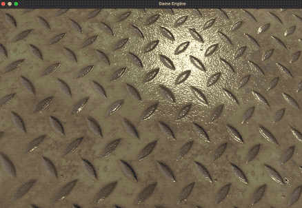
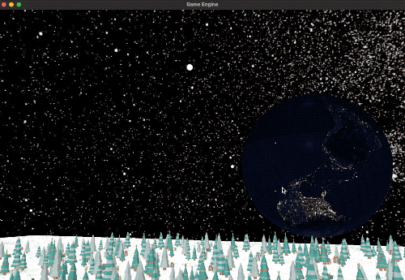

# Implement-a-Full-Game-Engine
- using Metal kit
- Swift
- Run on both Mac and iOS

### Phong Shadering & mtl & obj & material ..... as below

##### GIF1⬇️ 

##### GIF2⬇️ 

### TODOS📒

- [x] Load obj and mtl from file
- [x] Phong
- [x] Instance Rendering (60fps) 
- [x] Camera Movement
- [x] sky box (sky sphere)
- [ ] sky reflection
- [ ] Ray Tracing

