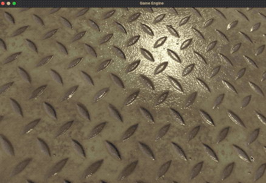
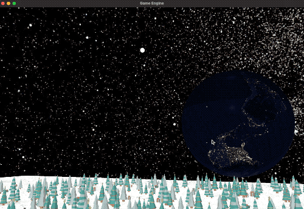

# Implement-a-Full-Game-Engine

## GameEngine

- using Metal kit
- Swift
- Run on both Mac and iOS

### Phong Shadering & mtl & obj & material ..... as below

##### GIF1⬇️ 



##### GIF2⬇️ 



### TODOS📒

- [x] Load obj and mtl from file
- [x] Phong
- [x] Instance Rendering (60fps) 
- [x] Camera Movement
- [x] sky box (sky sphere)
- [ ] sky reflection
- [ ] Ray Tracing

### dependency

```
xcode11 or higher
```


## GameEngineOpenGl

- c++
- run on visual studio
- using OpenGL frameworks
- reference: https://learnopengl.com/Getting-started

### dependency

```
glfw  https://www.glfw.org/
glew  http://glew.sourceforge.net/
stbi  https://github.com/nothings/stb/blob/master/stb_image.h
glm   https://glm.g-truc.net/0.9.8/index.html
```

